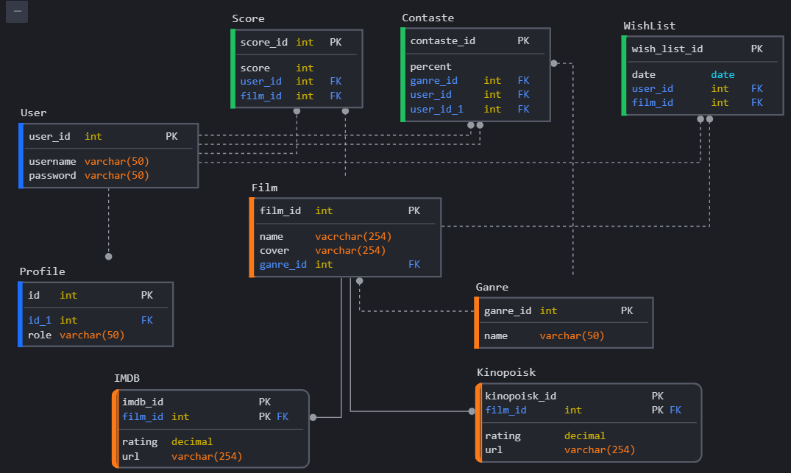

1. Схема БД для веб-сервиса "Совкусники" (выдуманный).

2. Документация:
* User. Таблица пользователя.
* Profile. Таблица профиля пользователя.
* Genre. Жанры фильмов.
* Film. Таблица фильмов.
* IMDB. Таблица с информацией из imdb (ссылка и рейтинг)
* Kinopoisk. Таблица с информацией из кинопоиска (ссылка и рейтинг)
* Score. Оценка пользователем фильма.
* Contaste. Процент совпадения оценок двух пользователей (совкусие).
* Wishlist. Вишлист пользователя